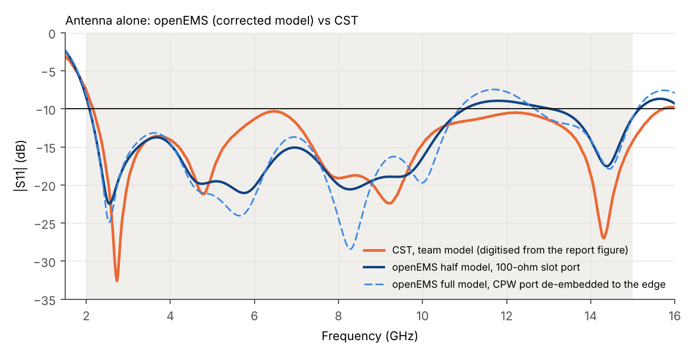
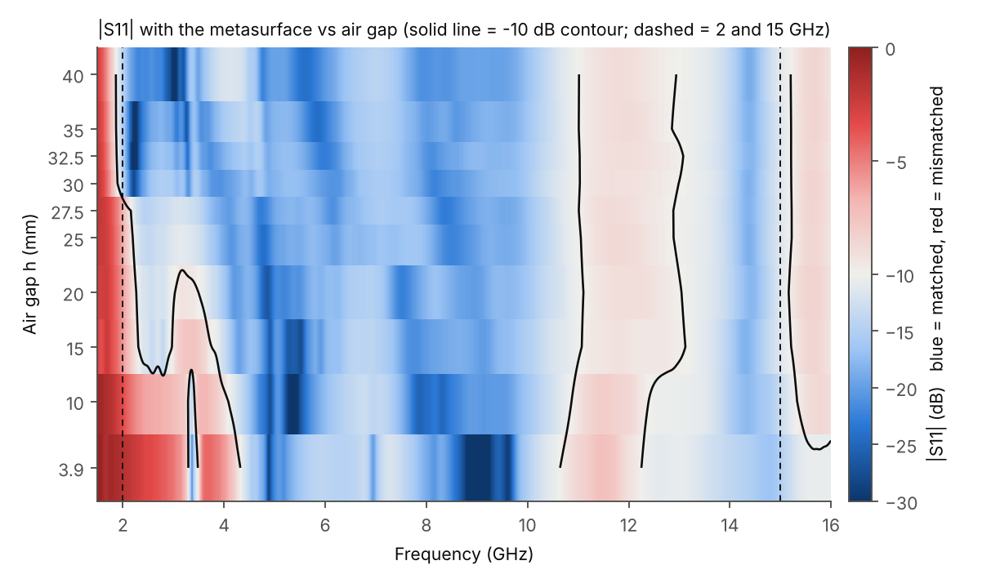
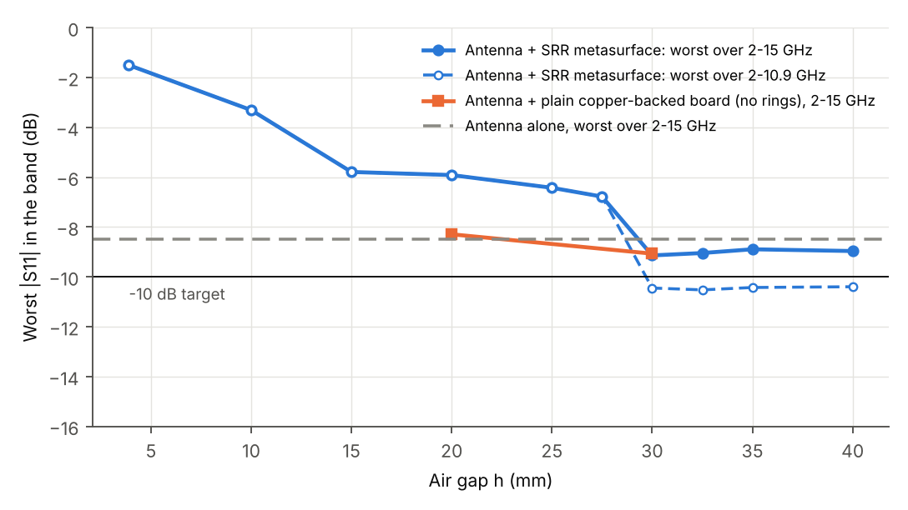
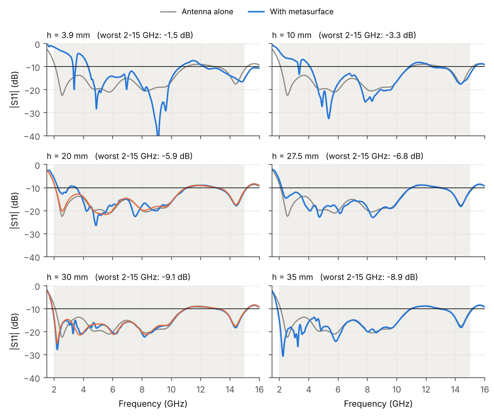
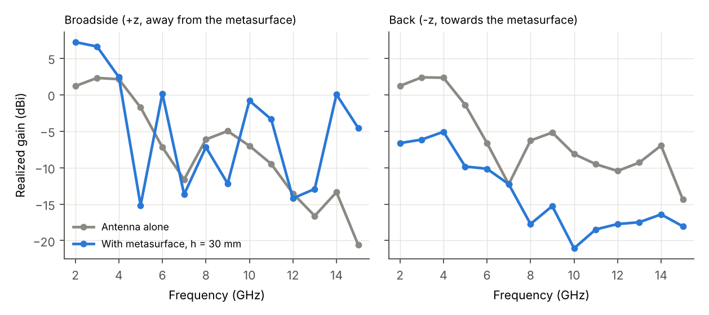

# Air-gap study: CPW decagon UWB antenna + ground-backed SRR metasurface

**Question:** what air gap between the 6 × 5 split-ring metasurface and the CPW antenna keeps
|S11| < −10 dB over the whole 2–15 GHz band?

**Method in one line:** full-wave FDTD simulation of the real geometry (openEMS, validated against the
team's CST result), swept over the gap, plus three independent "council" checks: an analytical model,
a literature review, and an audit of the simulation model.

---

## 1. Short answer

1. **3.9 mm (the current CST model) is far too small.** The metasurface's copper ground sits 7.1 mm behind
   the radiator and shorts out its low band: |S11| is −1.5 dB at 2 GHz and the antenna is unmatched from
   2.0 to 4.3 GHz.
2. **With the metasurface as described (15 mm rings → ~100 × 100 mm board), about 30 mm of air (antenna copper
   to metasurface ground ≈ 33 mm) is the smallest gap that keeps the low band.** At h = 30 mm the −10 dB band
   starts at 1.9 GHz (−14.4 dB at 2.0 GHz) and runs to 11.0 GHz; 32.5, 35 and 40 mm behave the same. Every gap of 27.5 mm or less loses 2.0–2.15 GHz or more. Gaps of 20 mm or less also open
   a second hole around 3–3.7 GHz. **Working window: 30–40 mm. Aim for 32.5–35 mm,** which keeps ≥ 4.8 dB of
   margin at 2.0 GHz and tolerates ±2.5 mm of spacer error. (If the metasurface is really a 50 × 50 mm board,
   i.e. the given "R" values are diameters: ≥ 20 mm is needed to keep 2.1–4 GHz, and neither 20 nor 30 mm
   recovers 2.0–2.1 GHz; see §5.4.)
3. **No gap gives |S11| < −10 dB over all of 2–15 GHz in this model.** The remaining failure, 11.0–13.0 GHz
   (−9 dB), belongs to the antenna itself. It is there without the metasurface (CST: −10.5 dB, openEMS: −7.5 to
   −9 dB, i.e. marginal in both), and any gap ≥ 15 mm changes it by less than 0.3 dB. Fix it in the antenna
   (feed gap / ground edge / a ground slot), not with the gap.
4. **At ~30 mm the metasurface is no longer doing "metasurface" work.** With a full copper ground and these
   ring sizes it reflects like a metal plate over most of 2–15 GHz. A plain copper board gives the same S11 at
   30 mm, and a *better* low band than the rings at 20 mm (§5.3). At 30 mm that gives +4 to +6 dB broadside
   gain at 2–3 GHz, but broadside nulls near 5 GHz (−15 dBi) and 9 GHz, exactly where a plate 33 mm behind
   the antenna puts them. So the gap that satisfies S11 is not a low-profile design, and it does not raise the
   gain across UWB.

---

## 2. What was simulated

### Antenna (from the team's CST model, unchanged)

| Item | Value |
|---|---|
| Board | FR-4, εr 4.3, tan δ 0.025, 50 × 50 × 1.6 mm, copper on the front only |
| CPW feed | strip x = −1.5…1.5 mm, slots 0.5 mm |
| Grounds | x = −25…−2 and 2…25 mm, y = −25…−7 mm (18 mm long) |
| Patch | regular decagon, circumradius 15 mm, centre (0, 8) mm, flat edges top and bottom; bottom edge at y = −6.27 mm (0.73 mm above the grounds) |
| Port | at the board edge, y = −25 mm |

### Metasurface: given vs assumed

| Item | Value | Source |
|---|---|---|
| Rings | outer ring r = 7.0–7.5 mm, inner ring r = 5.0–5.5 mm (0.5 mm strips, 1.5 mm apart) | **given** |
| Array | 6 × 5 cells | **given** |
| Substrate / back | 1.6 mm FR-4 with a full copper ground | repo (`MIDSEM_STUDY_PACK.md`, CST screenshot) |
| Board size / pitch | 100 × 100 mm; 16.67 mm pitch along the feed (6 cells), 20 mm across (5 cells) | **assumed**: 15 mm rings need ≥ 90 mm, and the screenshot shows a near-square board with these pitch ratios |
| Splits | 0.5 mm straight cuts on the feed axis (outer ring toward the port, inner toward the patch top) | **assumed**: not visible at the screenshot's resolution |
| Placement | centred under the antenna, rings facing the antenna | **assumed** |
| Gap h | air between the antenna substrate's back face and the ring layer, so antenna copper → metasurface ground = h + 3.2 mm | definition used throughout |

A second geometry was also simulated as a sensitivity check: the given numbers read as **diameters**, giving a
50 × 50 mm metasurface the same size as the board (see §5.4).

---

## 3. Method

* **Solver:** openEMS v0.0.37 (open-source FDTD), built from source. One small patch makes its Debye material
  update multi-threaded (`simulation/openems_patch/`); it was verified bit-for-bit identical to the stock solver.
* **Model:** half model with a PMC symmetry wall on the feed axis and a 100 Ω lumped port across one CPW slot,
  equivalent to the full antenna's 50 Ω port. It was checked against a full model with a CPW transmission-line
  port de-embedded to the board edge.
* **Material:** FR-4 as a causal Debye + conductivity fit to εr 4.3 / tan δ 0.025 (tan δ 0.023–0.027 over
  2–15 GHz). It agrees with a 5-pole fit within 0.25 dB. Copper is modelled as zero-thickness PEC.
* **Mesh:** 0.25 mm cells over the antenna, 0.5 mm over the rest of the metasurface and 0.2 mm through both
  substrates, graded elsewhere. The PML is ≥ 55 mm from the structure. Runs use 2.7 M (antenna alone) to
  7.8 M cells. The end criterion is −40 dB energy, checked deterministically. The ring connectivity of the
  staircased mesh was verified for every ring.
* **Audit:** a red-team review of the first model version found three real problems: the symmetry wall was
  half a cell off the feed axis, the FR-4 model was too lossy at 2 GHz, and the PML was too close. All three
  were fixed, and every result here comes from the corrected model.

---

## 4. Validation: antenna alone, openEMS vs CST



| Feature | CST (team) | openEMS half model | openEMS full model (CPW port) |
|---|---|---|---|
| Lower −10 dB edge | 2.16 GHz | 2.08 GHz | 2.09 GHz |
| First dip | 2.73 GHz, −32.7 dB | 2.55 GHz, −22.5 dB | 2.55 GHz, −24.9 dB |
| Hump near 3.6 GHz | −13.5 dB | 3.67 GHz, −13.7 dB | 3.62 GHz, −13.2 dB |
| Weak point near 6.5–7 GHz | −10.3 dB | 6.96 GHz, −15.1 dB | 6.94 GHz, −13.7 dB |
| Region 11–13 GHz | −10.5 dB (passes by 0.5 dB) | −8.9 dB at 11.8 GHz (fails by 1.1 dB) | −7.5 dB at 11.7 GHz (fails) |
| High dip | 14.32 GHz, −27.1 dB | 14.38 GHz, −17.5 dB | 14.44 GHz, −17.9 dB |

The two solvers agree on the shape and the resonance positions. They disagree by 1.5–3 dB at 11–13 GHz, so
**treat that band as marginal**. The CST result's 0.5 dB margin there is not robust.

---

## 5. Results

### 5.1 Gap sweep



| Gap h (mm) | Antenna copper → MS ground (mm) | \|S11\| at 2.0 GHz | Fails (2–15 GHz) | Worst 2–10.9 GHz | Verdict |
|---|---|---|---|---|---|
| no MS | — | −8.5 dB | 2.00–2.07, 11.02–13.03 | −8.5 dB | antenna alone |
| 3.9 (current) | 7.1 | −1.5 dB | 2.00–3.29, 3.49–4.32, 10.65–12.25 | −1.5 dB | ✗ low band destroyed |
| 10 | 13.2 | −3.3 dB | 2.00–3.28, 3.42–4.08, 10.87–12.39 | −3.3 dB | ✗ |
| 15 | 18.2 | −5.8 dB | 2.00–2.30, 2.97–3.75, 11.08–13.12 | −5.8 dB | ✗ |
| 20 | 23.2 | −5.9 dB | 2.00–2.26, 3.03–3.49, 11.11–13.04 | −5.9 dB | ✗ |
| 25 | 28.2 | −6.4 dB | 2.00–2.19, 11.06–12.88 | −6.4 dB | ✗ (bottom edge only) |
| 27.5 | 30.7 | −6.8 dB | 2.00–2.15, 11.02–12.88 | −6.8 dB | ✗ (bottom edge only) |
| **30** | 33.2 | −14.4 dB | 11.04–12.98 only | −10.4 dB | ✓ low band |
| **32.5** | 35.7 | −15.2 dB | 11.04–13.07 only | −10.5 dB | ✓ low band |
| **35** | 38.2 | −15.3 dB | 11.02–12.85 only | −10.4 dB | ✓ low band |
| 40 | 43.2 | −14.3 dB | 11.02–12.94 only | −10.4 dB | ✓ low band (weaker near 4 GHz, −11.9 dB) |



The step between 27.5 and 30 mm is real, not noise. At 20–27.5 mm the metasurface creates a resonance loop
near 2.1 GHz where the input resistance rises to ≈ 110 Ω (2.0 GHz: 80 + j62 Ω at 25 mm). At 30 mm the loop
collapses toward 50 Ω (72 + j9 Ω at 2.0 GHz), and at 40 mm the impedance stays at 51–57 Ω from 2 to 2.8 GHz.



### 5.2 Gain at the gap that fixes S11 (h = 30 mm)



Realized gain, dBi (half model mirrored, near-to-far-field transform):

| f (GHz) | 2 | 3 | 4 | 5 | 6 | 7 | 8 | 9 | 10 | 11 | 12 | 13 | 14 | 15 |
|---|---|---|---|---|---|---|---|---|---|---|---|---|---|---|
| Broadside, antenna alone | 1.2 | 2.3 | 2.1 | −1.8 | −7.2 | −11.6 | −6.1 | −5.0 | −7.0 | −9.5 | −13.5 | −16.6 | −13.4 | −20.6 |
| Broadside, with MS at 30 mm | 7.2 | 6.6 | 2.4 | −15.2 | 0.1 | −13.7 | −7.2 | −12.2 | −0.8 | −3.4 | −14.2 | −12.9 | 0.0 | −4.6 |
| Back, with MS at 30 mm | −6.6 | −6.2 | −5.1 | −9.8 | −10.2 | −12.3 | −17.7 | −15.3 | −21.1 | −18.5 | −17.7 | −17.5 | −16.4 | −18.0 |

The broadside nulls at 5 and 9 GHz are where the metasurface ground is λ/2 and λ behind the radiator
(33 mm ≈ λ/2 at 4.5 GHz, ≈ λ at 9 GHz).

### 5.3 Rings vs a plain copper-backed board

Control runs used the same FR-4 board and copper ground, with no rings.

| f (GHz) | 2.0 | 2.2 | 2.5 | 3.0 | 3.3 | 3.6 | 6.0 | 12.0 | Fails (2–15 GHz) |
|---|---|---|---|---|---|---|---|---|---|
| SRR metasurface, h = 20 mm | −5.9 | −8.9 | −12.5 | −10.2 | −9.4 | −10.8 | −17.6 | −9.0 | 2.00–2.26, 3.03–3.49, 11.11–13.04 |
| Plain copper board, h = 20 mm | −8.3 | −12.5 | −19.9 | −15.2 | −13.4 | −12.8 | −19.6 | −9.1 | 2.00–2.08, 11.05–13.05 |
| SRR metasurface, h = 30 mm | −14.4 | −27.4 | −17.6 | −16.0 | −20.9 | −18.3 | −20.4 | −9.2 | 11.04–12.98 |
| Plain copper board, h = 30 mm | −13.7 | −24.8 | −17.2 | −14.8 | −17.0 | −20.8 | −21.0 | −9.1 | 11.01–13.10 |

* **At 30 mm the rings are close to irrelevant**: 0.76 dB rms difference from the plain board over 2–15 GHz.
  The copper ground does the work, as the analytical model predicted: the ring fundamentals are too weakly
  excited at normal incidence to give an in-phase band.
* **At 20 mm the rings make it worse.** The plain board fails only at 2.00–2.08 GHz, about the same as the
  antenna alone. The SRR metasurface fails 2.00–2.26 and 3.03–3.49 GHz (2.3 dB rms, up to 7.5 dB, worse).
  Close to the antenna, the near field drives the rings' resonances (outer and inner ring modes around
  2–4 GHz), and those resonances detune the match. The 3–3.7 GHz hole at 15–20 mm and the high-resistance
  loop near 2.1 GHz at 20–27.5 mm are ring effects, not ground-plane effects.

**For matching, this ring cell is at best neutral and at moderate gaps harmful.**

### 5.4 Sensitivity: 50 × 50 mm metasurface ("R values are diameters")

Same antenna, but the metasurface is a 50 × 50 mm board (the size of the antenna) with 7.5 mm outer rings
(radii 3.5–3.75 and 2.5–2.75 mm, 0.25 mm splits, pitch 10 × 8.33 mm), still with a full copper ground. The
antenna region was meshed at 0.2 mm for these runs, so they are compared with a bare-antenna run on the
same mesh.

| Gap h (mm) | \|S11\| at 2.0 GHz | Fails (2–15 GHz) | Verdict |
|---|---|---|---|
| no MS (0.2 mm mesh) | −8.8 dB | 2.00–2.05, 10.98–12.47 | antenna alone |
| 3.9 | −1.1 dB | 2.00–4.30, 10.56–12.36, 13.07–13.49 | ✗ low band destroyed |
| 10 | −2.2 dB | 2.00–4.10, 11.04–12.90 | ✗ |
| 20 | −8.1 dB | 2.00–2.10, 11.63–13.21 | almost: only the bottom 0.1 GHz |
| 30 | −7.1 dB | 2.00–2.11, 11.46–13.17 | almost: only the bottom 0.1 GHz |

What changes with the smaller board:

* **Small gaps are just as bad.** 3.9 mm and 10 mm lose 2–4 GHz, exactly like the 100 mm metasurface. A
  ground-backed board the size of the antenna still shorts out the low band.
* **From ~20 mm up it disturbs the antenna less.** At 20 mm it fails only at 2.00–2.10 GHz, versus 2.00–2.26
  and 3.03–3.49 GHz for the 100 mm board.
* **It cannot pull 2.0 GHz in.** At 30 mm the 100 mm board is a ~λ/4 reflector at 2 GHz and gives
  −14 dB there. A 50 mm board is only 0.33 λ wide at 2 GHz, too small to do that, so 2.00–2.1 GHz stays
  at −7 to −8 dB, slightly worse than the antenna alone. With a board this size, the 2.0 GHz edge has to
  be fixed in the antenna.

---

## 6. Why: the physics

* **The metasurface is ground-backed, so the antenna sees a mirror.** With these ring sizes, the analytical
  council member estimates a reflection phase of ≈ 170° at 2 GHz falling to ≈ 100° at 15 GHz, with |Γ| ≈ 1:
  metal-like, set mainly by the copper ground behind 1.6 mm of FR-4. The rings only matter in narrow lines
  (≈ 3.8, 5.2, 5.6, 7.5 GHz), and their fundamental modes are too weakly excited at normal incidence to create
  an in-phase (AMC) band at 2–3.6 GHz. The plate control in §5.3 confirms it.
* **A mirror close behind a planar monopole kills its low band.** The image current is opposite and only
  2 × (h + 3.2) mm away, so it cancels the radiating current. At h = 3.9 mm, image theory puts the radiation
  resistance at 2.16 GHz at about 8 % of its free-space value. The full-wave runs show the same: −1.5 dB at
  2 GHz. A plain copper-backed board at the same gap behaves the same way (§5.3).
* **The low band comes back once the ground is about λ/4 away at the bottom of the band.** λ/4 at 2.26 GHz is
  33 mm, i.e. h ≈ 30 mm. There the reflected wave adds in phase, so 2 GHz matches better than with no
  metasurface at all. The literature agrees. Of ~20 UWB-antenna-plus-reflector papers reviewed, none reports a
  7:1 (2–15 GHz-like) match with a ground-backed reflector at any gap. The ground-backed designs that hold
  3.1–10.6 GHz use 6.75–10 mm stacks and stop at ≤ 12 GHz. The two readable gap sweeps (Din 2023, Yuan 2019)
  show the low band failing first as the gap shrinks.
* **But a reflector 33 mm away cancels the broadside wave wherever the spacing is λ/2, λ, …** (4.5, 9,
  13.5 GHz). That is the price of the large gap.

---

## 7. What to do

1. **Do not use 3.9 mm.** If you keep this metasurface, sweep h from 25 to 40 mm in CST and expect the
   low-band match to come back around 28–30 mm. Report S11 together with realized gain and the PEC-plate
   control at each gap.
2. **Give the antenna itself margin at 11–13 GHz** before claiming 2–15 GHz. That region is ≈ −10 dB without
   any metasurface, and the gap cannot fix it.
3. **If the goal is a low-profile metasurface with gain over UWB,** this cell will not do it at any gap. You
   need a cell with a real in-phase band (dual-resonant / multilayer / thicker spacer) or a sub-band claim.
   The current geometry is effectively a metal plate.
4. **Run the CST check with the time-domain solver** (broadband, no interpolation artefacts), at a finer mesh
   than the bare-antenna run. That will settle the 11–13 GHz disagreement.

---

## 8. Reproducing the simulations

```bash
# openEMS v0.0.37 from https://github.com/thliebig/openEMS-Project (optionally apply
# simulation/openems_patch/debye_multithread.patch), Python bindings in a venv, then:
cd simulation
export LD_LIBRARY_PATH=/opt/openEMS/lib
python cpw_ms_openems.py --case bare  --model half --out run          # antenna alone (~2 min)
python cpw_ms_openems.py --case ms    --h 3.9 10 20 30 --out run      # with the metasurface (~15 min each)
python cpw_ms_openems.py --case plate --h 30 --out run                # copper-backed board, no rings
MS_VARIANT=small python cpw_ms_openems.py --case ms --h 20 --fine_ant 0.2 --tag _small --out run
python cpw_ms_gain.py --case ms --h 30 --out run                      # realized gain (NF2FF)
python plot_gap_sweep.py run figures
```

Raw results (S11, Zin as CSV; run metadata as JSON) are in `simulation/results/`.
